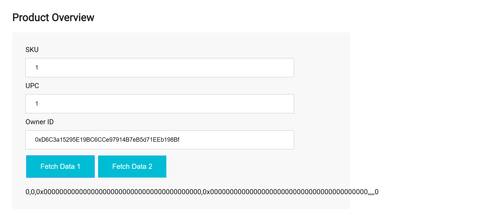
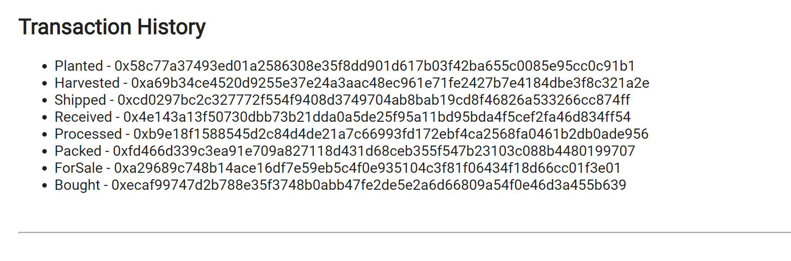

#### transaction hash (Transaction ID):   
* 0x026dbb994772f71b0a1c575e8b9fa5e665fb7f4d7dc2a7dfc609c527cb6a2edf
#### Contract address on Rinkeby :  
* 0x8Dc3575117306700ED9ab011E751614CEf80159F

# Supply chain & data auditing

This repository containts an Ethereum DApp that demonstrates a Supply Chain flow between a Farmer and Buyer. The user story is similar to any commonly used supply chain process for dates. The farmer will ship dates to partner who is going to post the dates for sell after middle steps. A buyer then can buy the dates.

The DApp User Interface when running should look like...








## Getting Started

These instructions will get you a copy of the project up and running on your local machine for development and testing purposes with all required libraries. 

### Prerequisites

Please make sure you've already installed Truffle and enabled MetaMask extension in your browser.

```
npm install -g truffle
```
[Google chrome web store for MetaMask](https://chrome.google.com/webstore/detail/metamask/nkbihfbeogaeaoehlefnkodbefgpgknn?hl=en)


### Installing

A step by step series of examples that tell you have to get a development env running

Clone this repository:

```
git clone https://github.com/Alamink/Project-6.git
```

Change directory to ```project-6``` folder and install all requisite npm packages (as listed in ```package.json```):

```
cd project-6
npm install
```

Launch truffle:

```
truffle develop
```

Your terminal should look something like this:


Now you are in tuffle develpoment terminal, Compile smart contracts:

```
compile
```

Your terminal should look something like this:


This will create the smart contract artifacts in folder ```build\contracts```.


Test smart contracts:

```
test
```

All tests should pass.


In a separate terminal window, launch the DApp:

```
npm run dev
```

## Built With

* [Ethereum](https://www.ethereum.org/) - Ethereum is a decentralized platform that runs smart contracts
to make the web faster, safer, and more open.
* [Truffle Framework](http://truffleframework.com/) - Truffle is the most popular development framework for Ethereum with a mission to make your life a whole lot easier.


## Acknowledgments

* Solidity - ^0.4.24 (solc-js)
* Truffle v5.0.19 (core: 5.0.19)
* Node v10.15.3
* Web3.js v1.0.0-beta.37